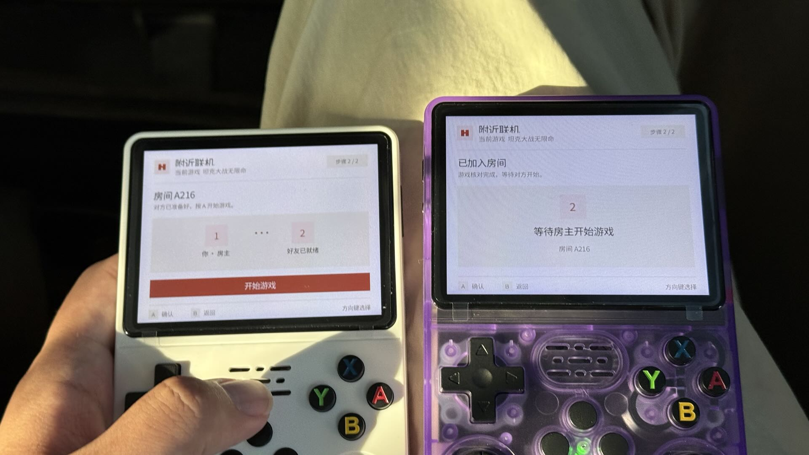
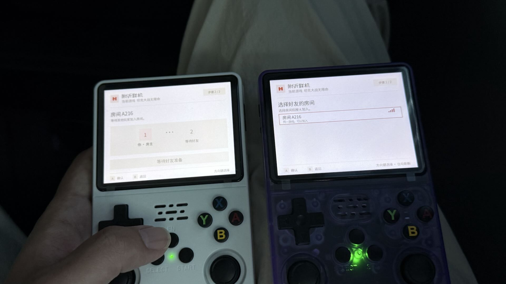
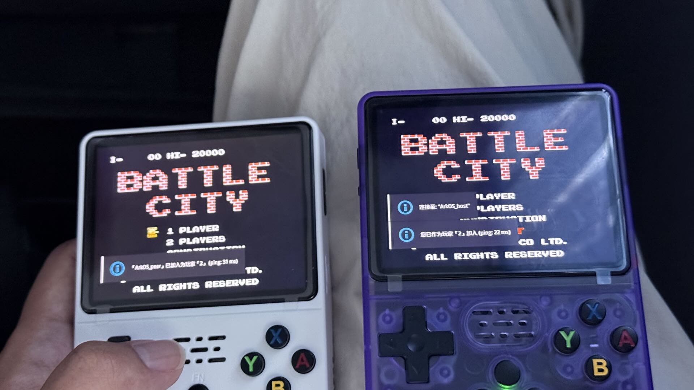
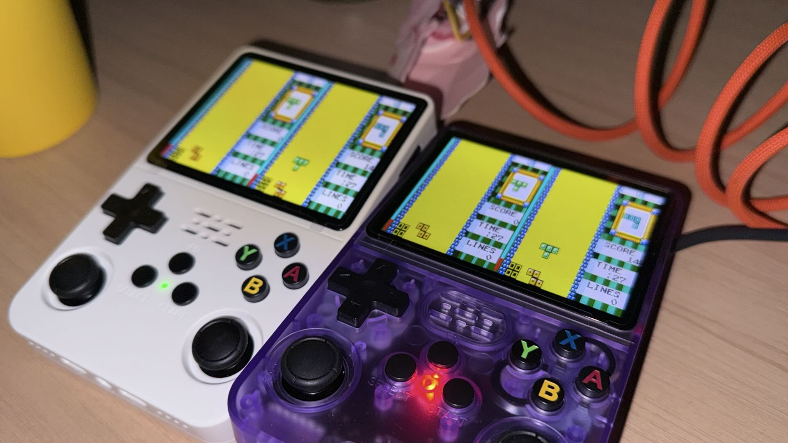
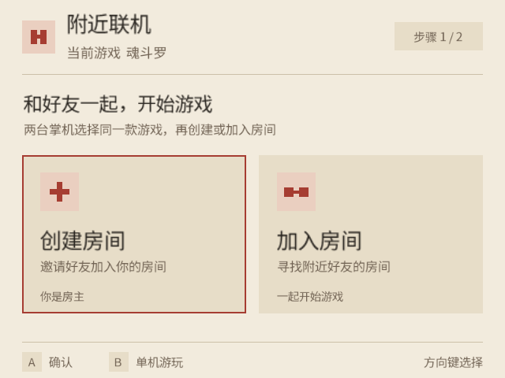
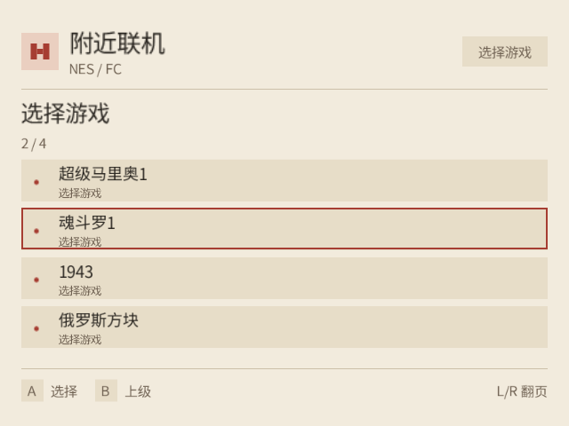
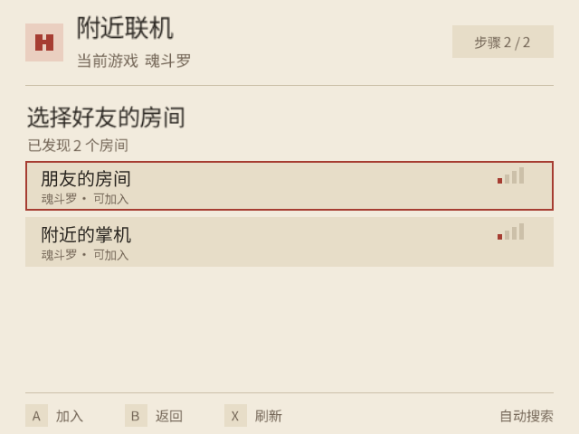
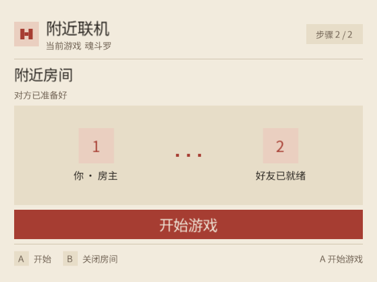
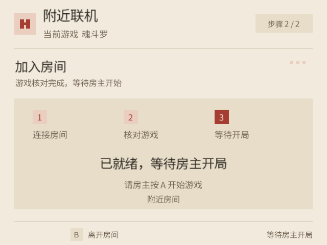

**R36S 双机附近联机**

  

选好游戏，创建房间，和身边的朋友一起玩。

[下载安装](https://github.com/W-Mai/arkos-nearby/releases/tag/v0.3.0) · [使用说明](docs/installation.md) · [游戏兼容性](docs/compatibility.md) · [源码构建](docs/building.md)

## 附近联机

ArkOS Nearby 用 Wi-Fi Direct 连接两台 R36S。中文图形界面支持手柄操作，从选择房间到开始游戏，都可以在掌机上完成。

- **当前游戏直接联机** — 在游戏列表选好游戏，启动时按住 X，进入创建／加入房间界面。
- **从游戏库挑选** — 在 Options → Nearby Multiplayer 中选择平台和游戏。
- **搜索身边的房间** — 选中房间后加入，按 X 刷新列表。
- **记住常玩的朋友** — 首次连接由房主确认，之后使用保存的配对信息。
- **玩完回到游戏列表** — 退出游戏后恢复之前连接的 Wi-Fi。

## 安装

适用配置：**ArkOS4Clone 08262026 · Linux 4.4.189 · RTL8188EU 无线芯片 · 640×480 屏幕**。详细要求见 [设备兼容性](docs/compatibility.md#设备配置)。在两台掌机上安装同一版本：

1. 下载 [ARM64 安装包](https://github.com/W-Mai/arkos-nearby/releases/download/v0.3.0/arkos-nearby-0.3.0-arm64.tar.gz)。
2. 解压，将 `arkos-nearby` 文件夹放入游戏卡的 `ports` 目录。
3. 在掌机 **Ports** 中打开 **Install Nearby Multiplayer**。

[安装说明](docs/installation.md) 提供 SSH 安装、更新和卸载命令。

## 一起玩

两台先选同一款联机游戏：从游戏列表启动时按住 **X**；或进入 **Options → Nearby Multiplayer**，选择平台和游戏。

一台创建房间，另一台选中该房间后按 **A** 加入。首次连接时，房主按 **A** 确认。游戏核对会自动进行，显示「对方已准备好」后，房主选择 **开始游戏**。

需要在游戏内选择双人或连接线模式的游戏，进入游戏后继续选择对应模式。准备期间按 **B** 可以取消或离开房间。

| 方向键 | A | B | X | L / R |
| :---: | :---: | :---: | :---: | :---: |
| 移动焦点 | 确认 | 返回／离开 | 刷新房间列表 | 游戏列表翻页 |

## 双机实拍

<table>
  <tr><td align="center"><b>搜索房间</b></td><td align="center"><b>坦克大战</b></td></tr>
  <tr><td></td><td></td></tr>
</table>

  
  
俄罗斯方块

界面预览

  

<table>
  <tr><td align="center"><b>选择游戏</b></td><td align="center"><b>搜索房间</b></td></tr>
  <tr><td></td><td></td></tr>
  <tr><td align="center"><b>房主开始游戏</b></td><td align="center"><b>加入者等待开局</b></td></tr>
  <tr><td></td><td></td></tr>
</table>

## 文档

[安装与更新](docs/installation.md) · [平台与游戏](docs/compatibility.md) · [问题排查](docs/troubleshooting.md) · [从源码构建](docs/building.md)

应用源码采用 [MIT](LICENSE)，组件许可证和来源见 [第三方组件](docs/third-party.md)。
